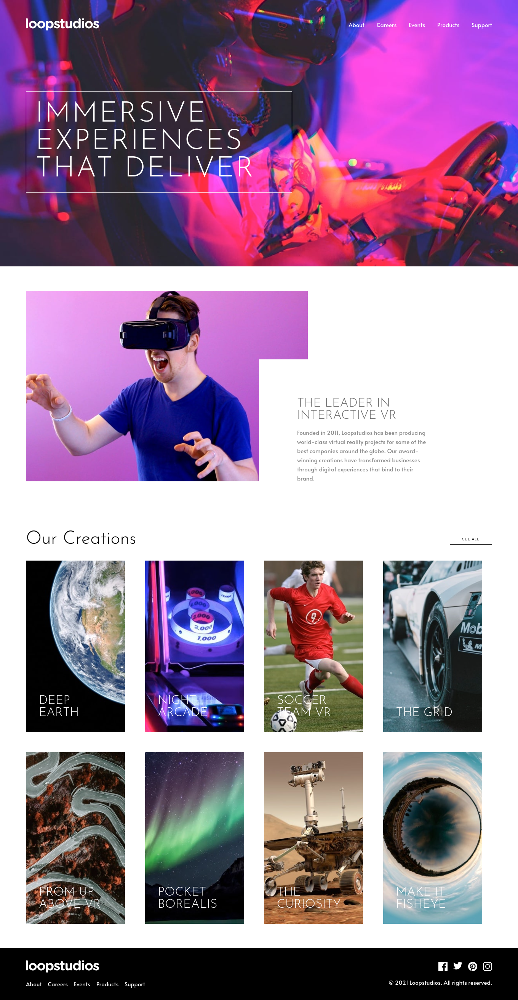
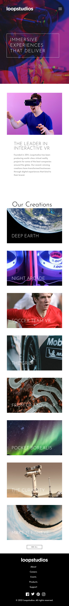

# Frontend Mentor - Loopstudios landing page solution

This is a solution to the [Loopstudios landing page challenge on Frontend Mentor](https://www.frontendmentor.io/challenges/loopstudios-landing-page-N88J5Onjw). Frontend Mentor challenges help you improve your coding skills by building realistic projects. 

## Table of contents

- [Overview](#overview)
  - [The challenge](#the-challenge)
  - [Screenshot](#screenshot)
  - [Links](#links)
- [My process](#my-process)
  - [Built with](#built-with)
  - [What I learned](#what-i-learned)
  - [Continued development](#continued-development)
  - [Useful resources](#useful-resources)
- [Author](#author)
- [Acknowledgments](#acknowledgments)

**Note: Delete this note and update the table of contents based on what sections you keep.**

## Overview

### The challenge

Users should be able to:

- View the optimal layout for the site depending on their device's screen size
- See hover states for all interactive elements on the page

### Screenshot




### Links

- Solution URL: [Source Code](https://github.com/blaqbox-prime/loopstudios-landing-page)
- Live Site URL: [Live Site](https://blaqbox-prime.github.io/loopstudios-landing-page/)

## My process


### Built with
- CSS custom properties
- Flexbox
- CSS Grid
- Desktop-first workflow

### What I learned

I decided to use this project to get a little more practice with the basics; Flexbox, CSS-Grid and responsive design. Always finding that spending so much time using react and css libraries/frameworks makes me feel like I'm relying too much on them and not really understanding or dulling my sense for the underlying tehnologies. Just a little sharpening of the basics is a necessity for me now and then. I realize I don't have some of these concepts down as much as I thought I did. I think


Tried to make a responsive grid thing based on a clip I saw on instagram. Happy with the results.

```html
 <div class="creations__grid">
      <div class="creation c1">
        <h2 class="creation__text">
          Deep earth 
        </h2>
      </div>
      <div class="creation c2">
        <h2 class="creation__text">
          Night arcade
        </h2>
      </div>
      <div class="creation c3">
        <h2 class="creation__text">
          Soccer team VR
        </h2>
      </div>
      <div class="creation c4">
        <h2 class="creation__text">
          The grid
        </h2>
      </div>
      <div class="creation c5">
        <h2 class="creation__text">
          From up above VR
        </h2>
      </div>
      <div class="creation c6">
        <h2 class="creation__text">
          Pocket borealis
        </h2>
      </div>
      <div class="creation c7">
        <h2 class="creation__text">
          The curiosity
        </h2>
      </div>
      <div class="creation c8">
        <h2 class="creation__text">
          Make it fisheye
        </h2>
      </div>
    </div>
```

THE GRID CONTAINER
```css
.creations__grid{
    display: grid;
    grid-template-columns: repeat(4, minmax(auto,260px));
    gap: 3.5em;
}
```

THE CARD
```css
.creation{
    grid-column-end: span 1;
    height: 450px;
    padding:2.25em;
    position:relative;
    display: flex;
    flex-direction: column-reverse;
}

.creation:hover{
    cursor: pointer;
}
```

CARD HOVER EFFECT
```css
.creation::after{
    content: "";
    position: absolute;
    left: 0;
    top: 0;
    height: 0;
    width: 100%;
    background-color:rgba(255, 255, 255, 0.8);
    transform-origin: center;
    transition: all .3s ease-in-out;
}

.creation:hover::after{
    height:100%;
}

.creation:hover  .creation__text{
    transition: color .5s ease-out .3s;
    color: var(--colors-very-dark-gray);
}
```

## Usefull resources
- [w3schools](https://www.w3schools.com)


## Author

- Website - [Portfolio](https://portfolio-sambo.web.app/)
- Frontend Mentor - [@blaqbox-prime](https://www.frontendmentor.io/profile/blaqbox-prime)
- Instagram -[@ig_blaqbox.dev](https://www.instagram.com/ig_blaqbox.dev)
